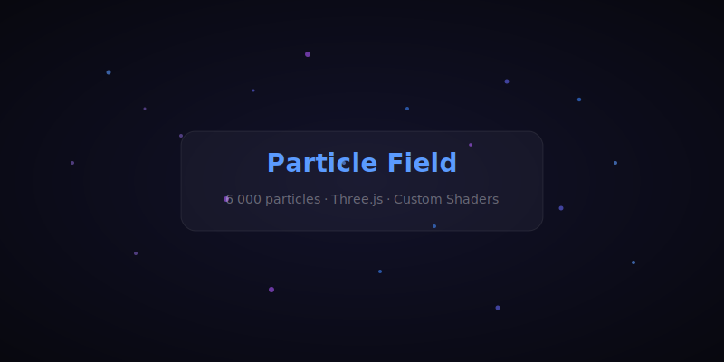

# Particle Field

Interactive 3D particle field built with Three.js — 6000 particles with additive blending, vertex colours, mouse-responsive rotation and organic wave motion.

## Run

Open index.html in a browser (served via any static server).

`ash
npx serve .
`

## Stack

- Three.js (ESM via importmap)
- Custom ShaderMaterial (vertex colours, size attenuation, soft circles)
- No build step — single HTML file

## License

MIT © [Alex Black](https://github.com/AlexBlack-Dev)